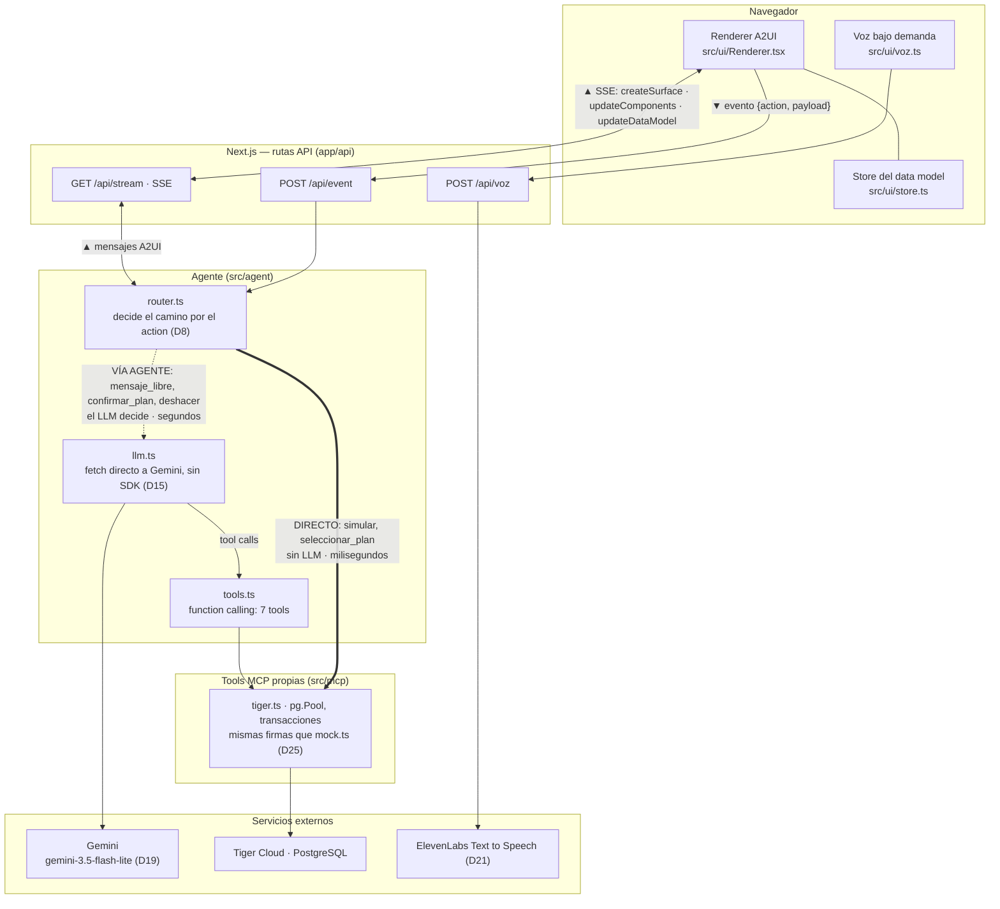
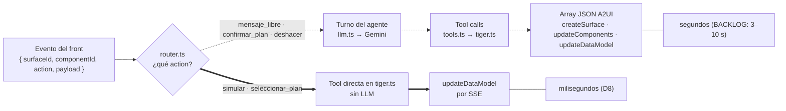

# Pixy — Documento técnico para jueces

Reto Banorte · HackMTY 2026 · Equipo AFND

Todo lo que dice este documento se puede comprobar en el repositorio: los
ADR están en [`docs/DECISIONS.md`](DECISIONS.md) (se citan como D1…D29), el
contrato de interfaz en [`docs/A2UI.md`](A2UI.md), los límites conocidos en
[`docs/BACKLOG.md`](BACKLOG.md) y el resto en el código. Donde un dato no
existe en esas fuentes, no está aquí.

---

## 1. Resumen

**El problema.** Sofía Torres tiene 67 años y una tarjeta de crédito
Banorte con saldo de $85,240.00 a una tasa anual de 68.50 %
(`db/seed.sql`). Sus preferencias de accesibilidad son texto grande, alto
contraste, alertas visuales, navegación simple y lector de pantalla
(`db/seed.sql`, tabla `preferencias`); ese conjunto de banderas se mapea al
perfil `sencillo` (comentario en `db/seed.sql`, D12).

**La solución.** Pixy (D18) es un agente que no responde con texto sino con
interfaz: a partir de la intención del usuario ("no me alcanza para pagar
mi tarjeta", "¿en qué se me va el dinero?") y de su perfil de accesibilidad
(`sencillo`, `normal`, `detallado`; D12), compone la pantalla eligiendo
piezas de un catálogo cerrado de siete componentes (A2UI.md §4) y la manda
al navegador como JSON. El navegador la pinta; nunca ejecuta código que
venga del agente (A2UI.md §1). En el perfil `sencillo` la letra crece 1.4×,
los botones miden 68 px (`src/ui/a2ui.css`), las tarjetas son opacas y de
alto contraste (D27) y Pixy puede leer en voz alta cada `ExplanationCard`
(D21–D23).

**El resultado verificable.** El flujo completo — diagnóstico, simulación
de planes, selección, confirmación y calendario — escribe y revierte en una
base PostgreSQL real en Tiger Cloud (D7, D25): `aplicar_plan` inserta en
`planes_aplicados` y deja la tarjeta en estado `reestructurado`;
`deshacer_plan` restaura el saldo inicial y deja la base exactamente como
estaba. Ambas operaciones corren en transacción (`src/mcp/tiger.ts`). La
sección 5 dice qué consultas correr para comprobarlo.

---

## 2. Arquitectura

Un solo repositorio, un solo deploy, un solo lenguaje: TypeScript de punta
a punta con Next.js (App Router); el agente y las tools viven como rutas
API de la misma aplicación (D1). Deploy automático a DigitalOcean App
Platform desde `main` (D2). Dependencias de producción: `next`, `react`,
`react-dom` y `pg` (`package.json`). El LLM es Gemini, llamado con `fetch`
directo sin SDK (D3, D15); la base es Tiger Cloud (PostgreSQL) vía `pg`
(D25).



Los dos caminos que decide `router.ts` según el `action` exacto del evento:



**Los dos caminos de eventos (D8) son el corazón del diseño.** Todo lo que
el usuario toca produce el mismo cuerpo de evento (A2UI.md §5) y el front
no sabe cuál camino tomará. El backend decide por el `action` exacto
(`src/agent/router.ts`):

| Camino | Acciones | Qué pasa | Latencia |
|---|---|---|---|
| Directo | `simular`, `seleccionar_plan` | El router llama la tool y responde con `updateDataModel`. No hay decisión que tomar, así que no hay LLM. | Milisegundos (D8) |
| Vía agente | `mensaje_libre`, `confirmar_plan`, `deshacer` | El evento se inyecta como turno en la conversación; Gemini decide qué tools llamar y qué pantalla componer. | Segundos (BACKLOG: 3–10 s; la burbuja de Pixy en "pensando" lo cubre) |

Mover el slider de plazo o elegir una fila recalcula la tabla al instante
porque nunca sale hacia el LLM; escribir un mensaje o confirmar un plan sí,
porque ahí hay algo que decidir.

**Otras decisiones de arquitectura que los jueces pueden comprobar:**

- El estado de sesión y el hub de SSE viven en memoria del proceso (D13),
  con una sola conexión SSE activa por sesión (D20). La bienvenida se emite
  de forma determinista al conectar, sin LLM, y una recarga a mitad del flujo
  rehidrata la pantalla en la que estaba el usuario en vez de volver al
  inicio (D28).
- El agente ve siete tools (`obtener_diagnostico`, `simular_planes`,
  `seleccionar_plan`, `aplicar_plan`, `deshacer_plan`, `obtener_movimientos`,
  `guardar_perfil`; `src/agent/tools.ts`). Seis de ellas tienen las mismas
  firmas en el mock (`src/mcp/mock.ts`, el contrato) y en la implementación
  real (`src/mcp/tiger.ts`); cambiar de una a otra es cambiar un import
  (D25). `seleccionar_plan` no toca la base: la resuelve el propio router
  con el estado de la sesión, igual que el clic en la fila
  (`src/agent/router.ts`). Hoy tanto `tools.ts` como `router.ts` importan
  `tiger.ts`; el texto de D25 aún describe el paso intermedio en que
  `router.ts` seguía en el mock, y manda el código.
- `aplicar_plan` y `deshacer_plan` corren en transacción con `FOR UPDATE`
  sobre la cuenta (`BEGIN`/`COMMIT`/`ROLLBACK`, `src/mcp/tiger.ts`; D25). Si
  `DATABASE_URL` no existe, el módulo falla al cargar con un mensaje claro;
  si la base no responde, el pool corta a los 5 s en vez de colgarse (D25).
- La voz es una capacidad del front, no del agente: el JSON del LLM no sabe
  que existe (D22). Se genera bajo demanda: al tocar la bocina y, si el
  usuario dejó encendida la lectura continua, al montarse cada
  `ExplanationCard` nueva (D21, D23); con caché por texto, y cualquier fallo
  del proveedor deja el botón inactivo sin romper nada (D21).

---

## 3. El protocolo A2UI

Un subconjunto propio de A2UI, definido en `docs/A2UI.md` y con renderer
propio (D4). Cuatro principios (A2UI.md §1): el agente manda intención, no
código; estructura y datos viajan separados; los componentes leen datos por
ruta, no por valor; todo `action` viaja al backend.

**Tres tipos de mensaje** (A2UI.md §3):

| Mensaje | Para qué | Cuándo |
|---|---|---|
| `createSurface` | Abre la pantalla y fija el perfil de accesibilidad | Una vez por sesión o cuando cambia el perfil; el servidor lo re-emite además en cada reconexión SSE para rehidratar la pantalla (D28) |
| `updateComponents` | Reemplaza el árbol de componentes | Cuando cambia la intención |
| `updateDataModel` | Cambia valores por ruta (`/simulacion/plazo`) | Cuando solo cambian números |

**Catálogo de siete componentes** (A2UI.md §4): `StatCard`,
`ComparisonTable`, `SliderControl`, `ExplanationCard`,
`ActionConfirmationModal`, `ScheduleList`, `SuggestionChips`. El único
contenedor es `Column`. Un `type` desconocido se ignora y se registra en
consola; el renderer nunca evalúa nada que venga en el JSON. El perfil no
cambia el catálogo: los tres perfiles usan los mismos componentes y el
renderer aplica tokens visuales (escala, contraste, densidad) según
`data-profile` (D12, D17).

**El argumento de adaptabilidad: misma pieza, dos intenciones.** La
`ComparisonTable` es la prueba. En la intención de deuda es un selector de
planes; en la intención de gastos es un desglose por categoría con barras de
porcentaje. Mismo componente, mismo renderer: sin componentes nuevos, sin
caminos directos nuevos y sin cambio de contrato (D24). Lo que se agregó
para la segunda intención fue la tool `obtener_movimientos` y una sección
del prompt (D24); la barra es un refuerzo de presentación para toda celda
`percent`, no un componente (D29). El prompt del agente
(`src/agent/systemPrompt.ts`) fija las keys de las columnas, las rutas
`$ref` y el `action` de ambas formas; los `id`, las etiquetas y qué columnas
del plan se muestran los elige el LLM en cada turno:

*Intención 1 — deuda: la tabla es un selector.* Cada fila es un plan, elegir
una dispara `seleccionar_plan` por el camino directo (D8) y la fila con
`recomendado: true` (menor interés total, calculado en la tool; D16) muestra
el badge "Recomendado".

```json
{
  "id": "tabla-planes", "type": "ComparisonTable",
  "columns": [
    { "key": "id", "label": "Plan", "format": "plain" },
    { "key": "tasa", "label": "Tasa", "format": "percent" },
    { "key": "pago_mensual", "label": "Pago mensual", "format": "currency" },
    { "key": "interes_total", "label": "Interés total", "format": "currency" }
  ],
  "rows": { "$": "/simulacion/planes" },
  "selectedKey": { "$": "/simulacion/selectedKey" },
  "action": "seleccionar_plan"
}
```

*Intención 2 — gastos: la tabla es un desglose.* `action: null` (previsto
en el contrato: `action: string | null`, A2UI.md §4), las filas vienen de
`obtener_movimientos` y la columna de porcentaje pinta una barra proporcional
(D29). En perfil `sencillo` el agente emite solo dos columnas (D24).

```json
{
  "id": "table-categorias", "type": "ComparisonTable",
  "columns": [
    { "key": "categoria", "label": "Categoría", "format": "plain" },
    { "key": "total", "label": "Total", "format": "currency" },
    { "key": "porcentaje", "label": "Porcentaje", "format": "percent" }
  ],
  "rows": { "$": "/gastos/categorias" },
  "action": null
}
```

Lo mismo pasa con el resto del catálogo en esa segunda intención: el
`StatCard` que en deuda muestra el saldo muestra el gasto del mes, la
`ScheduleList` que muestra el calendario de pagos muestra los últimos
movimientos de la categoría mayor, y los `SuggestionChips` ofrecen "Volver a
mi deuda" para regresar al flujo original en la misma sesión (D24). Es el
paso 6 del flujo del demo en A2UI.md §6 — "una composición distinta del
mismo catálogo"; allí el ejemplo era bloquear la tarjeta y D24 lo concretó
en gastos — que D24 resume como "misma biblioteca, intención distinta,
composición distinta".

---

## 4. Trade-offs

**Modelo y costo (D3, D15, D19).** Gemini Flash-Lite, no un modelo grande.
El default es `gemini-3.5-flash-lite` (`src/lib/llm.ts`), elegido
consultando en vivo la lista de modelos y descartando alias flotantes y
variantes de imagen (D19). La razón es operativa: la cuota diaria del nivel
gratuito es de unas 1,000 peticiones en Flash-Lite contra 20 en los modelos
preview, y un demo en vivo no puede depender de una cuota que se agota en la
primera ronda de pruebas. Limitaciones observadas del LLM (BACKLOG): a veces
pone montos literales donde debería ir una referencia (cosmético, sin fix) y
a veces devuelve JSON inválido, que el router mitiga con un reintento y una
tarjeta de respaldo (`src/agent/router.ts`). Todo el proveedor vive detrás
de `llm.ts`, seleccionable por `LLM_PROVIDER` — hoy solo `gemini` está
implementado (D3) — y el modelo se elige con `GEMINI_MODEL`, así que cambiar
de modelo es una variable de entorno (D19).

**Memoria del proceso frente a persistencia (D7, D13, D20).** La
conversación y el hub de SSE viven en un `Map` del proceso Node, con una
sola conexión SSE activa por sesión — la anterior se cierra en el servidor
(D20) — y un redeploy borra las sesiones activas (D13). Lo que sí persiste es lo que
importa al negocio: perfil, planes aplicados y saldo, en Tiger Cloud en vez
de SQLite porque el filesystem de DigitalOcean es efímero (D7). Aceptamos
la memoria local porque el deploy es una sola instancia persistente y porque
no bloquear el slice vertical valía más que la durabilidad de la sesión en
48 h. La consecuencia visible se corrigió: una recarga rehidrata la pantalla
desde la sesión en memoria (D28), pero un restart sí empieza de cero.

**Protocolo propio frente a librería (D4, D14, D17).** Un
subconjunto de A2UI escrito a mano — tres mensajes, siete componentes (D4
nació con seis; D12 agregó `SuggestionChips`, A2UI.md §4), un renderer de
unos cientos de líneas — en vez de una librería de UI generativa
completa; tokens de perfil con variables CSS en vez de Tailwind. Ganamos
control total del catálogo y cero dependencias que pudieran romper el build;
perdimos todo lo que una spec completa ya resuelve (múltiples superficies,
anidación más allá de `Column`, validación de formularios; A2UI.md §8). Lo
que el contrato no especificaba lo cerramos con ADR, por ejemplo que el LLM
responde con un array de mensajes por turno (D14).

**Qué decide el LLM y qué no (D8, D28).** La regla es: el LLM
decide solo donde hay una decisión. Mover el slider o elegir una fila va
directo a la tool en milisegundos (D8); la bienvenida es un JSON fijo que se
emite al conectar (D28); la selección por texto llama una tool que llena las
mismas rutas que el clic. A cambio, el flujo se siente rápido y predecible
en las interacciones frecuentes, y el LLM se reserva para componer pantallas
y explicar. El costo es que cada atajo directo fija un `action` con nombre
exacto y hay que enseñárselo al prompt; D8 corta cualquier atajo directo
nuevo, y D24 lo respetó: la intención de gastos va toda vía agente.

---

## 5. Cómo comprobarlo

Variables de entorno (`CLAUDE.md`): `LLM_PROVIDER=gemini`, `GEMINI_API_KEY`,
`DATABASE_URL` (cadena de Tiger Cloud; necesaria también en build, D25) y,
opcional, `ELEVENLABS_API_KEY` para la voz y `GEMINI_MODEL` (default
`gemini-3.5-flash-lite` según `src/lib/llm.ts` y D19; el ejemplo de
`GEMINI_MODEL` en `CLAUDE.md` está desactualizado).

```bash
npm install
npm run build && npm start          # producción, puerto $PORT o 3000
curl -s http://localhost:3000/api/health            # {"ok":true}
curl -N "http://localhost:3000/api/stream?surfaceId=main"
# Primer byte inmediato y, sin escribir nada, la bienvenida en JSON A2UI (D28):
# createSurface + updateComponents con la ExplanationCard de Pixy y los tres chips de perfil.
```

Estado de la base antes y después de confirmar y deshacer un plan
(`db/esquema.sql`; Sofía es `usuarios.id = 1` y su tarjeta `cuentas.id = 1`
porque el seed reinicia las secuencias):

```sql
SELECT saldo_actual, estado FROM cuentas WHERE id = 1;
SELECT COUNT(*) FROM planes_aplicados;
```

Qué debe verse (el "antes" según `db/seed.sql`; el "después" según D25 y
`src/mcp/tiger.ts`): antes, `85240.00 | activo` y `0`; tras confirmar,
estado `reestructurado`, saldo igual al total a pagar bajo el plan y `1`
fila; tras deshacer, de vuelta a `85240.00 | activo` y `0`.

Flujo del demo (A2UI.md §6, con la bienvenida determinista de D28, el
onboarding de perfil y los chips que fija `src/agent/systemPrompt.ts`, y la
segunda intención de gastos de D24 en lugar del "bloquear la tarjeta" del
contrato): bienvenida → elegir perfil → "no me alcanza para pagar mi
tarjeta" → mover el slider (directo) → elegir un plan (directo) → "Aplicar
el plan elegido" → confirmar → ver el calendario → "¿en qué se me va el
dinero?" → "Volver a mi deuda" → deshacer.

---

## 6. Límites conocidos

Están en `docs/BACKLOG.md` y en la línea "si falta tiempo" de los ADR
(formato de `DECISIONS.md`: regla, razón, qué se corta si falta tiempo). Los
que un juez puede encontrar en el demo:

- El LLM a veces pone montos literales en `StatCard` o `ScheduleList` en vez
  de `$ref`; es cosmético y ocurre después de confirmar (BACKLOG).
- Los turnos que pasan por el LLM tardan 3–10 s; la burbuja de Pixy en
  "pensando" lo cubre (BACKLOG).
- Clic en fila de `ComparisonTable`: en Chrome headless funciona; en Chrome
  de escritorio (macOS) se reportó que no dispara `seleccionar_plan`. El
  workaround es elegir por texto o por chips (BACKLOG).
- `deshacer_plan` borra la fila de `planes_aplicados` para que la base vuelva
  al estado inicial exacto; una bitácora (`estado = 'cancelado'`) queda como
  mejora (D25, BACKLOG). Deshacer solo revierte el último plan activo (D10).
- Un restart o redeploy borra las sesiones en memoria (D13).
- JSON inválido del LLM: mitigado con un reintento y una tarjeta de
  respaldo; queda por observar su frecuencia (BACKLOG).

---

## 7. Dónde mirar según la rúbrica

Criterios y pesos tomados de la rúbrica oficial del reto (fuente externa al
repositorio).

| Criterio | Dónde está la evidencia |
|---|---|
| Utilidad (25 %) | §1 y §5: flujo completo de reestructuración con escritura y reversión reales en PostgreSQL (D5, D25). |
| Adaptabilidad de UI (20 %) | §3: mismo catálogo, dos intenciones, `ComparisonTable` como selector y como desglose (D24, D29); tres perfiles con el mismo árbol (D12, D27). |
| Calidad de IA (15 %) | §2 y §4: el LLM decide solo donde hay decisión (D8), function calling sobre siete tools, guardas del router para deriva del modelo (D28, BACKLOG). |
| Arquitectura (15 %) | §2: un solo deploy TypeScript (D1, D2), dos caminos de eventos (D8), tools intercambiables por firma (D25), transacciones. |
| Innovación (10 %) | §3: interfaz generada por intención y perfil sobre un protocolo A2UI propio (D4); lectura en voz alta fuera del árbol A2UI (D21–D23). |
| Diseño (10 %) | §1 y ADR D26, D27, D29: identidad Banorte, glassmorfismo por tokens con excepción total en `sencillo`, contraste AA medido. |
| Pitch (5 %) | §1 y §5: el resultado se demuestra con dos consultas SQL. |
